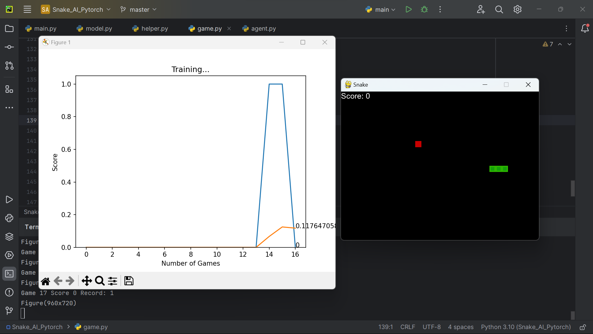
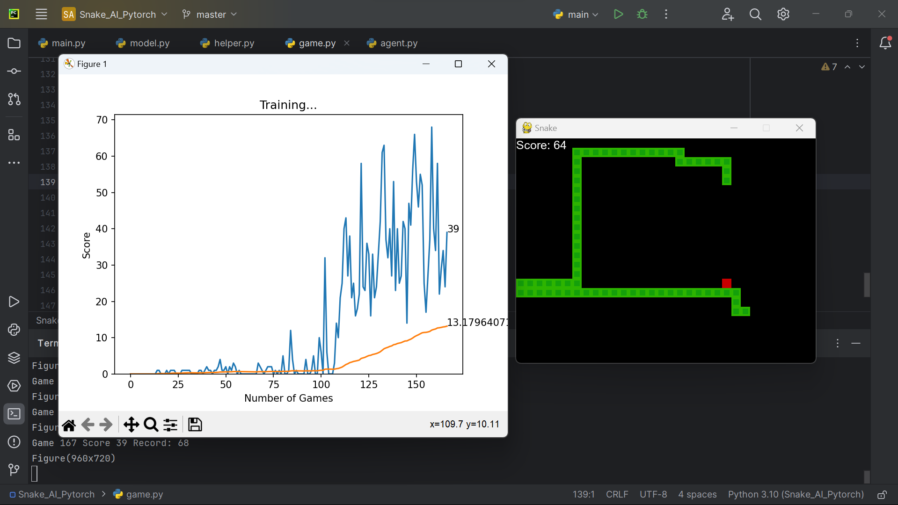

# SnakeGame_Python_AI_Pytorch
The "SnakeGame_Python_AI_Pytorch" project is a Python application using PyTorch to create a Snake Game with AI. The AI learns over time, improving its gameplay through reinforcement learning, gradually achieving higher scores.

# Screenshot
At first:

30 minutes later:

 
Cre: freeCodeCamp.org
